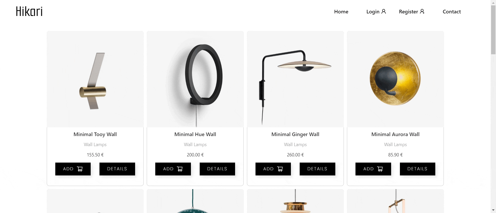
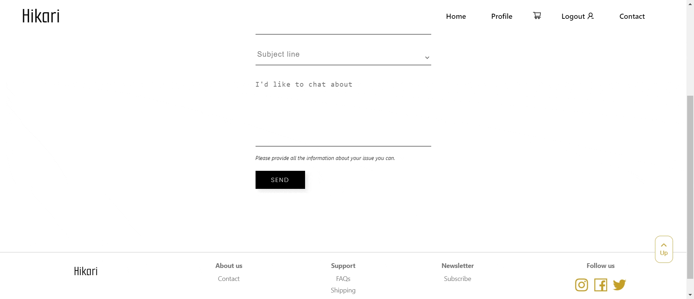

<h2 align="center">REACT FRONTEND PROJECT</h2> 
<h1 align="center">🛒 E-COMMERCE 🛍️</h1>
<h4 align="center">with React & Vite</h4>

 

    E-commerce made using Javascript, React, Vite and Sass.
     
    <a href="https://github.com/yolovi/project-frontend-ecommerce"><strong>Explore the docs »</strong></a>
     
    ·
    <a href="https://github.com/yolovi/project-frontend-ecommerce/issues">Report Bug</a>
    ·
    <a href="https://github.com/yolovi/project-frontend-ecommerce/issues">Request Feature</a>
  

## <h1 align="center"> ⚙️ Description | Development </h1>

In this project, everything learned up to now is brought together. I've developed an e-commerce platform where users will register, log in, view products, and create orders using the e-commerce API I built in the 1st Backend Project.

#### register - login:

### Challenge 🎢 & Skills Achieved

After analyzing the project requirements, I have created the following points:

- User registration.
- User login with validations.
- Show products and add to the cart.
- Create orders from cart.
- User profile view.

Implemented:
- React Router
- Context
- Reducer
- Sass

Note that this project was completed within a very limited timeframe as part of an exercise for The Bridge Valencia's FullStack Bootcamp.

### Technologies used :

    

#### profile - orders:

#### shop - detail product

#### contact - logout

## IMPLEMENT ✔
## Future Roadmap. Extras:

- [ ] Product Search Engine
- [ ] Implementation of filters, for example, allowing the filtering of products by price
- [ ] Admin view where product CRUD operations can be performed (only if you have the Admin role)
- [ ] The user with an Admin role should have a navigation option that takes them to the Admin view
- [ ] CRUD operations for products
- [ ] Add or remove a product from favorites
- [ ] Allow users to add reviews to a product
- [ ] Users can only edit and delete the reviews they create.
- [ ] Users can upload photos in reviews or change their profile picture.
- [ ] Users can like reviews of products.
- [ ] Users can view their orders in their profile.
- [ ] Implementation of guards (security measures)
- [ ] Ensure responsiveness.

## 🔗 Contributing

Contributions are what make the open source community such an amazing place to learn, inspire, and create. Any contributions you make are **greatly appreciated**.

If you have a suggestion that would make this better, please fork the repository and create a pull request. You can also simply open an issue with the tag "enhancement".
Don't forget to give the project a star! Thanks again!

1. Fork the project
2. Create your feature Branch (`git checkout -b feature/YourName`)
3. Commit your changes (`git commit -m 'Add some YourName`)
4. Push to the branch (`git push origin feature/YourName`)
5. Open a pull request.

## 📫 How to reach me:

📩 Or if you want to send me an email: **yolandalopevi@gmail.com**

### Developed by [_Yolanda López Vidal_](https://github.com/yolovi).

